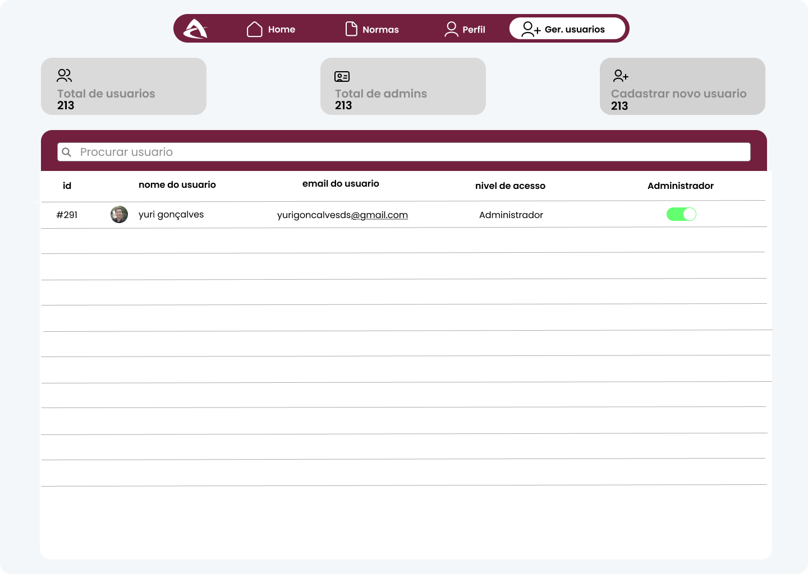
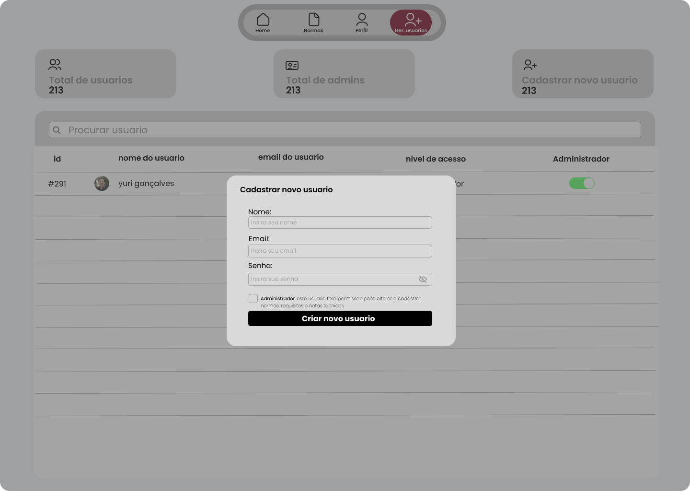
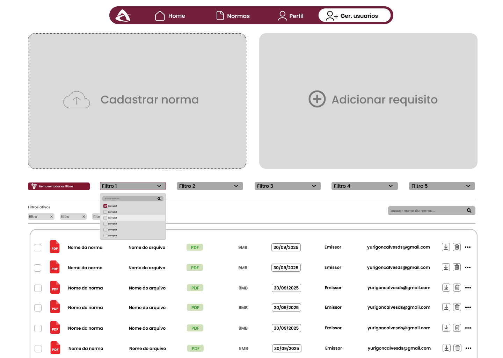
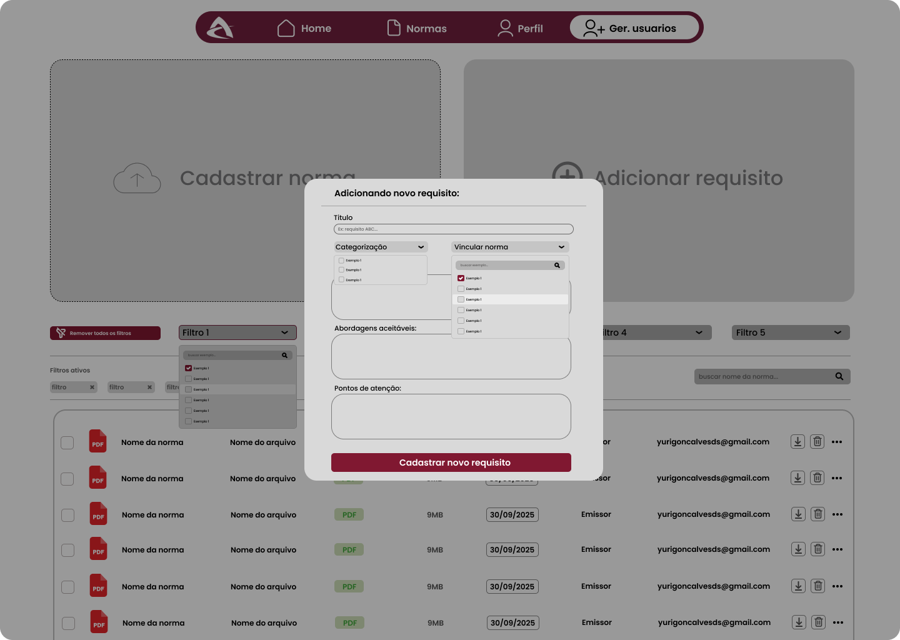

---

## 🗺️ LINHA DO TEMPO COMPLETA

### 1️⃣ **ENTRADA NO SISTEMA**

> Tela de login do sistema

### 2️⃣ **GERENCIAMENTO DE USUÁRIOS**

> Lista e gestão de usuários

### 3️⃣ **CADASTRO DE NOVO USUÁRIO**

> Formulário para criar novo usuário

### 4️⃣ **MODELO DE NORMAS**

> Modelo conceitual/diagrama de normas

### 5️⃣ **MENU DE NORMAS**

> Menu principal do módulo de normas

### 6️⃣ **ADICIONAR NORMA**

> Formulário para criar nova norma

### 7️⃣ **ADICIONAR REQUISITO**

> Formulário para criar novo requisito

### 8️⃣ **REQUISITOS COM DROPDOWN**

> Tela de requisitos com campo de seleção dropdown

---

## 🔄 FLUXO DE NAVEGAÇÃO
